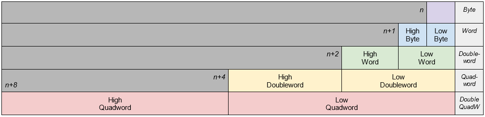

# Data Types

| C types | Name | Bits | Bytes |
| :----------- | :----------- | -----------: | -----------: |
| `char` | **Byte** | 8 | 1 |
| `short` | **Word** | 16 | 2 |
| `int`, `long` | **Doubleword** | 32 | 4 |
| `double`, `long long` | **Quadword** | 64 | 8 |
| n/a | **Double Quadword** | 128 | 16 |

# Sources
[Primitive Data Types: Integer Numbers](https://en.wikipedia.org/wiki/Primitive_data_type#Integer_numbers) \
[Integer (computer science): Common integral data types](https://en.wikipedia.org/wiki/Integer_(computer_science)#Common_integral_data_types)
