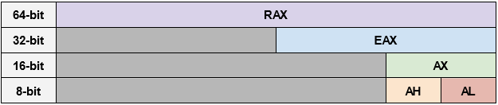

# Registers & EFLAGS

## Registers
### General Purpose
16-bit, in order of a push-to-stack operation:
| Register | Name | Description |
| ----------- | ----------- | :----------- |
| `AX` | **Accumulator** | Used in arithmetic operations, stores function return values |
| `CX` | **Counter** | Used in shift/rotate instructions, loops, and string operations |
| `DX` | **Data** | I/O pointer, used in arithemetic & I/O operations |
| `BX` | **Base** | Base pointer for data section |
| `SP` | **Stack Pointer** | Used to point to top of the stack |
| `BP` | **Stack Base Pointer** | Used to point to base of the stack |
| `SI` | **Source Index** | Source pointer for string operations, used as pointer to source in stream operations |
| `DI` | **Destination Index** | Destination pointer for string operations, used as pointer to destination in stream operations |

### Naming Conventions
Accumulator register in 8-, 16-, 32-, and 64-bit naming conventions:

### Other
| Register | Name | Description |
| ----------- | ----------- | :----------- |
| `EIP` | **Instruction Pointer** | Pointer for the next instruction to execute (if no branching), can only be read through stack after a `call` |

## EFLAGS
| Flag | Name | Description |
| ----------- | ----------- | :----------- |
| `SF` | **Sign Flag** | Set to most significant bit of result, which is the sign bit for signed ints (0 = positive, 1 = negative) |
| `ZF` | **Zero Flag** | Set if result of an operation is zero |

### Sources
[Wikibooks: x86 Assembly/X86 Architecture](https://en.wikibooks.org/wiki/X86_Assembly/X86_Architecture)
